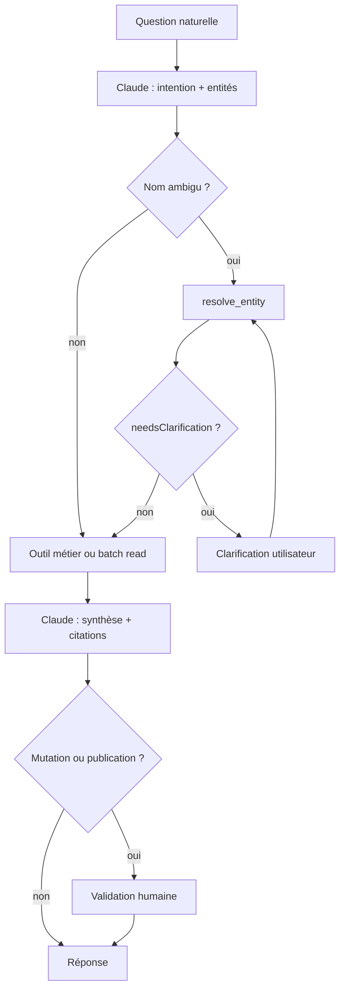

# MCP — cas d'usage, conception et développement

Document normatif pour le MCP Tomcat Core :

1. **Cas d'usage** — questions types, orchestration Claude + outils, critères d'acceptation
2. **Conception** — outils opinionated, contrat de sortie, alignement protocole MCP
3. **Développement** — checklist implémentation, roadmap, best practices

Complète :

- [society.md](./society.md) — vision produit et permissions
- [capabilities.md](./capabilities.md) — catalogue capabilities Society
- [auth-google-mcp.md](./auth-google-mcp.md) — auth MCP stdio et HTTP

Sources métier : audit équipe (`tomcat-audit`, sessions Kevin, Élie, Guillaume,
Sarah, Léna, Jérémy, Dealfy).

Références protocole :

- [MCP 2026-07-28 Release Candidate](https://blog.modelcontextprotocol.io/posts/2026-07-28-release-candidate/) — spec cible (final : 28 juillet 2026)
- [MCP Best Practices](https://modelcontextprotocol.info/docs/best-practices/) — architecture et production

**Sommaire** : §1–§3 conception · §4–§7 cas d'usage · §8–§9 limites · §10 plan dev · §11 index UC · §12–§17 protocole, contrats, implémentation

---

## 1. Objet et périmètre

### 1.1 Objectif

Décrire, pour chaque intention métier récurrente :

1. la **question naturelle** posée à Claude ;
2. la **chaîne d'outils MCP** attendue ;
3. la **contribution de Claude** (synthèse, jugement, rédaction) ;
4. les **critères d'acceptation** ;
5. le **statut d'implémentation** (livré, partiel, planifié).

Ce document sert de référence pour :

- concevoir de nouveaux outils MCP **opinionated** (pas des wrappers API) ;
- rédiger des specs d'acceptation et des tests ;
- former l'équipe sur ce que le MCP sait faire aujourd'hui vs demain ;
- **implémenter** le MCP en conformité protocole et best practices (§12–§16).

### 1.2 Périmètre

| Inclus | Exclus |
| --- | --- |
| Usage MCP **équipe interne** (`@tomcat.eu`, rôle `internal_team`) | Surface Society web (UI, BFF) |
| MCP **investisseur** Partner/LP (sous-ensemble outils, HTTP remote) | Extension Chrome, marketplace interne |
| Connecteurs HubSpot, Drive, Monday, Signal Hub | Dealfy, FullEnrich, Fintezis (planifiés P0/P1) |
| Cas pilotes v1 : board prep, digest portefeuille, BP | Génération de contenu publié automatiquement |
| stdio local (dev) + HTTP stateless (prod, spec 2026-07-28) | MCP Apps (UI iframe) en P0 |

### 1.3 Principe directeur

> **Claude orchestre. Le Core fait le travail de fond.**

Le MCP encode des **décisions métier Tomcat** (filtres, agrégations, formats de
sortie, règles de confidentialité). Claude interprète l'intention, choisit les
outils, synthétise et rédige. Il ne reconstruit pas l'accès aux données à
chaque session.

### 1.4 Règles transverses (consensus audit)

| Règle | Implication MCP |
| --- | --- |
| Matière oui, publication auto non | Les outils retournent du **brut structuré** ou des **drafts** ; l'humain publie |
| Enrichissement on-demand | FullEnrich / enrichissement contact uniquement sur deal qualifié |
| Resolve before read | Nom flou → `resolve_entity` avant toute lecture ciblée |
| Citations obligatoires | Toute synthèse Claude cite `Citation` / sources outils |
| Permissions serveur | Le filtrage ACL est dans Core, pas dans le prompt |
| Draft → validate → push | Mutations CRM (P1+) passent par validation humaine |

### 1.5 Architecture : un Core, deux surfaces MCP

```
                    TOMCAT CORE (services + connecteurs + ACL)
                                    │
              ┌─────────────────────┴─────────────────────┐
              ▼                                           ▼
     MCP interne (équipe)                      MCP investisseur (Partner/LP)
     · stdio local (dev)                        · HTTP remote stateless (prod)
     · 21+ outils, accès complet               · sous-ensemble filtré par tier
     · Google OAuth @tomcat.eu                 · OAuth Bearer + capabilities
     · capability: internal.tools              · pas de notes M1, pas de scoring
```

Même `AGENT_TOOL_REGISTRY` source ; filtrage au `tools/list` par persona/tier.
Ne pas créer deux codebases MCP.

---

## 2. Acteurs

| ID | Persona | Rôle | Priorité audit |
| --- | --- | --- | --- |
| `KEV` | Kevin | Dealflow, M2, sourcing, scoring | Sponsor opérationnel |
| `ELI` | Élie | M1, accompagnement Factory, boards, mémoire | Capital connaissance |
| `GUI` | Guillaume | Finance, BP, reporting, closing | 4–5 casquettes |
| `SAR` | Sarah | Comms, events, analytics investisseurs | Captation signal |
| `LEN` | Léna | Veille, Friday News, calendrier éditorial | Captation signal |
| `JER` | Jérémy | Parcours investisseur, Club, visibilité | Priorité business |
| `PAT` | Patrice | PM portefeuille, boards | Board prep |
| `INT` | Toute l'équipe | Questions transverses discovery | — |

---

## 3. Inventaire des outils

### 3.1 Statuts

| Statut | Signification |
| --- | --- |
| **LIVRE** | Enregistré dans `AGENT_TOOL_REGISTRY`, exécutable via MCP stdio |
| **PARTIEL** | Livré mais dépendance connecteur incomplète (ex. Monday signaux vides) |
| **PLANIFIE-P0** | Cas pilote v1 ou ROI prouvé audit ; spec à implémenter |
| **PLANIFIE-P1** | Forte valeur, phase 2 |
| **PLANIFIE-P2** | Utile, secondaire ou dépendances data |

Registre canonique : `src/agent/toolRegistry.ts`, enum `CoreToolNameSchema` dans
`src/domain/agent.ts`.

### 3.2 Outils livrés (21)

#### CRM / portfolio (12)

| Outil | Statut | Connecteurs | Rôle |
| --- | --- | --- | --- |
| `search_startups` | LIVRE | HubSpot | Discovery startups, id canonique |
| `read_startup_notes` | LIVRE | HubSpot | Notes filtrées permissions |
| `read_startup_deals` | LIVRE | HubSpot | Deals triés par update |
| `read_startup_meetings` | LIVRE | HubSpot | Timeline meetings |
| `list_portfolio_signals` | PARTIEL | Monday | Signaux portfolio (board Monday non câblé → `[]`) |
| `build_board_prep_context` | PARTIEL | HubSpot, Monday, Drive | Brief multi-sources rule-based |
| `resolve_entity` | LIVRE | HubSpot, Monday | Nom flou → ids cross-système |
| `list_company_crm_activity` | LIVRE | HubSpot | Batch notes/deals/meetings |
| `list_company_documents` | LIVRE | Drive | Fichiers par nom société |
| `read_company_document_excerpt` | LIVRE | Drive | Extrait texte Docs/Slides/Sheets |
| `list_portfolio_context` | PARTIEL | Monday | Métadonnées portfolio + signaux/events |
| `build_company_360_context` | LIVRE | HubSpot, Monday, Drive | Assembleur multi-sections |

#### Signal Hub (9)

| Outil | Statut | Notes |
| --- | --- | --- |
| `signal_hub_list_watched` | LIVRE | Watchlist entités |
| `signal_hub_add_watched` | LIVRE | Requiert `internal_team` |
| `signal_hub_set_priority` | LIVRE | hot / warm / cold |
| `signal_hub_recent_signals` | LIVRE | Par entité ou startup |
| `signal_hub_search_signals` | LIVRE | Recherche cross-entité |
| `signal_hub_resolve_entity` | LIVRE | Texte → watchedId |
| `signal_hub_list_accounts` | LIVRE | État comptes Unipile |
| `signal_hub_request_refresh` | LIVRE | Toujours async (jobId) |
| `signal_hub_freeze_account` | LIVRE | `approvalRequired` → bloqué MCP |

**Note technique** : Signal Hub doit être câblé dans `scripts/mcpServer.ts` pour
être exécutable en stdio (présent sur le serveur HTTP).

#### Service non exposé

| Capacité service | Statut | Commentaire |
| --- | --- | --- |
| `StartupsService.findSimilar` | Non exposé | Secteur partagé uniquement ; candidat `find_competitive_history` |

### 3.3 Outils planifiés

| Outil | Priorité | Connecteurs | Cas pilote v1 |
| --- | --- | --- | --- |
| `prepare_board_brief` | P0 | HubSpot, Monday, Drive, Signal Hub | Cas 1 |
| `generate_portfolio_signal_digest` | P0 | Signal Hub, HubSpot | Cas 3 |
| `resolve_company_drive_folder` | P0 | Drive | Cas 2 (prérequis) |
| `find_competitive_history` | P0 | HubSpot, Drive | — |
| `prepare_m1_meeting_brief` | P0 | HubSpot, Drive, web | — |
| `run_m2_financial_analysis` | P0 | Drive, HubSpot | ROI prouvé Kevin |
| `score_startup_list_against_thesis` | P0 | Dealfy, HubSpot | — |
| `synthesize_m1_from_transcript` | P1 | HubSpot, Drive | — |
| `generate_bp_from_template` | P1 | Drive | Cas 2 |
| `debrief_board_session` | P1 | Monday, Drive | — |
| `capture_factory_session` | P1 | Monday | — |
| `bulk_upsert_hubspot_deals` | P1 | HubSpot, Dealfy | — |
| `enrich_actionable_contact` | P1 | FullEnrich, HubSpot | — |
| `match_investors_to_deal` | P1 | HubSpot | — |
| `build_investor_dealflow_digest` | P1 | HubSpot, Drive | — |
| `extract_investors_from_deck` | P1 | Drive, HubSpot | — |
| `monthly_portfolio_status_digest` | P1 | Monday, HubSpot, Drive | — |
| `build_corporate_pipeline_brief` | P1 | HubSpot | — |
| `plan_editorial_calendar` | P2 | HubSpot, analytics | — |
| `analyze_communication_performance` | P2 | HubSpot, LinkedIn | — |
| `attribute_event_business_impact` | P2 | HubSpot | — |
| `send_quarterly_reporting_campaign` | P2 | HubSpot, Drive | — |
| `proactive_portfolio_risk_alerts` | P2 | HubSpot, Signal Hub | — |

### 3.4 Conventions pour tout nouvel outil

Chaque outil ajouté au registre doit respecter ce contrat (détail §13).

| Exigence | Règle |
| --- | --- |
| **Nom** | `snake_case`, verbe + objet métier (`prepare_board_brief`, pas `get_hubspot_data`) |
| **Description** | Quand l'appeler, quoi faire avant/après, sources et access level |
| **Input** | Zod `strict()`, defaults sensés, pas de paramètres API bruts |
| **Output** | JSON structuré ; voir §13 (`warnings`, `citations`, `nextSuggestedTools`) |
| **Async** | Opération > 5 s → retour immédiat `{ runId, status: "accepted" }` + polling ou Tasks extension |
| **Handles** | Workflows multi-étapes : id explicite repassé en argument (spec stateless 2026-07-28) |
| **Mutations** | Draft only ; confirmation humaine via elicitation (P1+) |
| **ACL** | Filtrage dans le service, jamais dans le handler MCP |
| **Registre** | `defineAgentTool` + `CoreToolNameSchema` + injection `mcpServer.ts` **et** `src/server.ts` |
| **Tests** | Service unit + MCP contract (`tests/mcp/server.test.ts`) + UC associé §5 |

**Anti-patterns** (ne pas shipper) :

- Wrapper CRUD (`list_hubspot_properties`, `search_drive`)
- Sortie blob non structurée sans citations
- Appel synchrone externe long (LinkedIn scrape, M2 complète)
- Publication auto sans gate humain
- Dépendance à Roots / Sampling MCP (dépréciés spec 2026-07-28)

---

## 4. Patterns d'orchestration

### 4.1 Resolve first

```
Question avec nom ambigu
  → resolve_entity(query)
  → si needsClarification : Claude demande précision
  → sinon : outils ciblés avec startupId / portfolioCompanyId
```

### 4.2 Batch read (vue 360°)

```
« Tout sur [Boîte] »
  → resolve_entity
  → list_company_crm_activity (includeNotes, includeDeals, includeMeetings)
  → list_company_documents
  → list_portfolio_context
  → signal_hub_recent_signals (si entité watchlist)
  → Claude assemble dossier structuré avec citations
```

Alternative livrée : `build_company_360_context` (sections configurables).

### 4.3 Brief métier (opinionated)

```
« Prep [M1 | board | call] sur [Boîte] »
  → resolve_entity
  → outil brief métier (prepare_* ou build_board_prep_context)
  → lectures complémentaires si lacunes (excerpt deck, signaux)
  → Claude formate selon persona, ajoute jugement
```

### 4.4 Digest périodique

```
« Digest [portefeuille | dealflow | Friday News] [période] »
  → generate_portfolio_signal_digest (P0) ou signal_hub_search_signals
  → Claude classe par thème, ne rédige pas le contenu public
```

### 4.5 Draft → validate → push (P1+)

```
Transcript post-session
  → outil synthèse (synthesize_m1_from_transcript, debrief_board_session)
  → Claude présente draft
  → Humain valide
  → Push HubSpot / Monday (outil mutation ou UI)
```

### 4.6 Diagramme



---

## 5. Cas d'usage par persona

Format de chaque cas :

- **Exemples** : formulations naturelles observées ou dérivées de l'audit
- **Chaîne MCP** : ordre d'appel recommandé
- **Rôle Claude** : ce que le LLM fait après les outils
- **Acceptation** : critères testables
- **Gate humain** : validation requise ou non

---

### 5.1 Kevin (`KEV`) — dealflow

#### UC-KEV-01 — Analyse financière M2

| Champ | Valeur |
| --- | --- |
| **Exemples** | « Le founder vient d'envoyer ses docs, fais-moi la M2 » ; « Analyse les relevés bancaires de [Boîte] » |
| **Intent** | Produire une analyse financière structurée (catégorisation, ratios, écarts MRR) |
| **Chaîne MCP** | 1. `resolve_entity` **LIVRE** → 2. `resolve_company_drive_folder` **P0** → 3. `run_m2_financial_analysis` **P0** → 4. *(P1)* note draft HubSpot |
| **Rôle Claude** | Synthèse analyste, questions closing, priorisation des flags |
| **Gate humain** | Kevin valide avant envoi au founder |
| **Source audit** | Kevin : 3h → 10 min (`session_rue_chaptal`) |

**Acceptation**

- **Given** docs financiers présents dans le dossier Drive conventionnel de la boîte
- **When** l'utilisateur demande une M2
- **Then** la sortie contient : flux catégorisés, ratios calculés, écart MRR déclaré vs encaissé si applicable, liste de questions, citations vers fichiers Drive
- **And** aucun enrichissement contact n'est déclenché automatiquement

---

#### UC-KEV-02 — Scoring liste event / CSV

| Champ | Valeur |
| --- | --- |
| **Exemples** | « 80 boîtes de VivaTech, lesquelles on contacte ? » ; « Score cette liste contre notre thèse » |
| **Intent** | Prioriser une liste entrante vs thèse Tomcat |
| **Chaîne MCP** | 1. `score_startup_list_against_thesis` **P0** → 2. *(opt P1)* `bulk_upsert_hubspot_deals` top-N → 3. *(opt P1)* `enrich_actionable_contact` sur top 3 |
| **Rôle Claude** | Tableau priorisé, rejects expliqués, plan d'action |
| **Gate humain** | Kevin choisit le seuil de push HubSpot |
| **Source audit** | 100 boîtes : 400 min → 3 min (`session_rue_chaptal`, `session_factory_1`) |

**Acceptation**

- **Given** une source liste (CSV, URL event) et une thèse configurée
- **When** scoring demandé
- **Then** chaque ligne a un score, une raison, un statut (priorité / reject)
- **And** règles confidentialité appliquées (CSV privé vs URL event mutualisable)

---

#### UC-KEV-03 — Enrichissement contact qualifié

| Champ | Valeur |
| --- | --- |
| **Exemples** | « Trouve le numéro du CEO de [Boîte] » ; « Enrichis le contact de ce deal chaud » |
| **Intent** | Obtenir coordonnées actionnables sans enrichissement masse |
| **Chaîne MCP** | 1. `resolve_entity` → 2. `read_startup_deals` + `read_startup_notes` → 3. `enrich_actionable_contact` **P1** si deal qualifié |
| **Rôle Claude** | Vérifie si contact déjà connu ; justifie l'appel enrichissement |
| **Gate humain** | Enrichissement déclenché seulement si deal qualifié (règle métier) |
| **Source audit** | FullEnrich on-demand (`session_factory_1`) |

---

#### UC-KEV-04 — État CRM d'une boîte

| Champ | Valeur |
| --- | --- |
| **Exemples** | « Qu'est-ce qu'on sait sur [Boîte] dans HubSpot ? » ; « Timeline complète de [Boîte] » |
| **Intent** | Reconstituer l'historique CRM |
| **Chaîne MCP** | 1. `resolve_entity` → 2. `list_company_crm_activity` **LIVRE** → 3. `read_company_document_excerpt` si deck référencé |
| **Rôle Claude** | Timeline narrative + points clés + citations |
| **Gate humain** | Non |
| **Statut** | **LIVRE aujourd'hui** |

**Acceptation**

- **Given** une boîte visible pour l'appelant
- **When** demande d'état CRM
- **Then** notes, deals, meetings retournés en un batch, triés, filtrés permissions
- **And** synthèse Claude cite note/deal/meeting ids

---

#### UC-KEV-05 — Comparaison sectorielle / concurrents

| Champ | Valeur |
| --- | --- |
| **Exemples** | « Compare [Boîte] aux autres HRTech qu'on a vues » ; « Boîtes similaires dans le funnel » |
| **Intent** | Contextualiser une boîte vs historique Tomcat |
| **Chaîne MCP** | 1. `resolve_entity` → 2. `find_competitive_history` **P0** → 3. `read_startup_notes` sur top matches → 4. *(fallback LIVRE)* `search_startups(sector)` + `read_startup_notes` |
| **Rôle Claude** | Tableau comparatif + so-what pour la cible |
| **Source audit** | Élie : concurrents vus depuis 5 ans (`session_factory_2`) |

---

### 5.2 Élie (`ELI`) — sélection et accompagnement

#### UC-ELI-01 — Prep M1

| Champ | Valeur |
| --- | --- |
| **Exemples** | « Demain M1 sur [Startup], prépare le brief » ; « Prep entretien sélection [Boîte] » |
| **Intent** | Brief prep structuré (grille Élie), pas résumé générique |
| **Chaîne MCP** | 1. `resolve_entity` → 2. `prepare_m1_meeting_brief` **P0** → 3. `find_competitive_history` **P0** → 4. `read_company_document_excerpt` (deck) |
| **Rôle Claude** | Red flags, debunk claims (ex-Google, exits), 5–10 questions ciblées |
| **Gate humain** | Élie valide avant le call |
| **Source audit** | Workflow M1 : prep 45 min (`session_factory_2`) |

**Acceptation**

- **Given** deck ou URL site disponibles
- **When** prep M1 demandée
- **Then** sortie contient sections grille Élie, angles absents du deck, concurrents historiques si existants
- **And** ton non générique (rejette le template IA vide)

---

#### UC-ELI-02 — Synthèse post-M1

| Champ | Valeur |
| --- | --- |
| **Exemples** | « Voici le transcript SeedExt, fais la note HubSpot » ; « Synthèse M1 [Boîte] » |
| **Intent** | Draft note M1 format HubSpot |
| **Chaîne MCP** | 1. `synthesize_m1_from_transcript` **P1** (transcript + deck + prep) → 2. Claude relit structure |
| **Rôle Claude** | Vérifie cohérence vs grille, signale sections faibles |
| **Gate humain** | **Obligatoire** — Élie édite avant publish |
| **Source audit** | Notes Claude pas encore publiables telles quelles |

---

#### UC-ELI-03 — Board prep

| Champ | Valeur |
| --- | --- |
| **Exemples** | « Board [Boîte] semaine prochaine, prépare tout » ; « Note de prep board pour Patrice / Webin » |
| **Intent** | Note prep : dernier board, chiffres, signaux, questions ouvertes |
| **Chaîne MCP** | 1. `resolve_entity` → 2. `build_board_prep_context` **PARTIEL** ou `prepare_board_brief` **P0** → 3. `list_company_documents(titleContains: "board")` → 4. `read_company_document_excerpt` → 5. `signal_hub_recent_signals` |
| **Rôle Claude** | Structure note exécutive, alertes divergence vs dernier CR |
| **Gate humain** | Non pour la prep ; oui pour diffusion Club |
| **Source audit** | Cas pilote v1 (`audit_log.md` §5) |

**Acceptation (état PARTIEL aujourd'hui)**

- **Given** portfolio company sur Monday + notes HubSpot + board packs Drive
- **When** board prep demandée
- **Then** `build_board_prep_context` retourne highlights, risks, citations
- **And** signaux Monday peuvent être vides tant que board signaux non câblé
- **And** Claude complète avec excerpts Drive et Signal Hub

---

#### UC-ELI-04 — Debrief post-board

| Champ | Valeur |
| --- | --- |
| **Exemples** | « Transcript board [Boîte], mets à jour Monday » ; « CR board + actions » |
| **Intent** | Capturer décisions, KPIs, risques, actions |
| **Chaîne MCP** | 1. `debrief_board_session` **P1** → 2. push Monday |
| **Gate humain** | Élie / PM valide avant push |

---

#### UC-ELI-05 — Brief corporate

| Champ | Valeur |
| --- | --- |
| **Exemples** | « Brief AgTech pour Eden Red sur 6 mois » ; « Startups pertinentes pour [Corporate] » |
| **Intent** | Liste startups vues matchant critères corporate |
| **Chaîne MCP** | 1. `build_corporate_pipeline_brief` **P1** → 2. `list_company_crm_activity` par candidat |
| **Source audit** | Eden Red 2–3×/an (`session_factory_2`) |

---

#### UC-ELI-06 — État mensuel portefeuille Factory

| Champ | Valeur |
| --- | --- |
| **Exemples** | « État du portefeuille Factory ce mois » ; « Compare les boîtes Factory sur leur vertical » |
| **Intent** | Digest consolidé impossible manuellement |
| **Chaîne MCP** | 1. `monthly_portfolio_status_digest` **P1** → 2. `build_company_360_context` sur alertes |
| **Source audit** | *« Un truc qu'on ne pouvait pas faire avant »* |

---

#### UC-ELI-07 — Recrutements portefeuille

| Champ | Valeur |
| --- | --- |
| **Exemples** | « Quelles boîtes Factory ont recruté un Head of Sales ce trimestre ? » |
| **Intent** | Requête signal cross-portefeuille |
| **Chaîne MCP** | 1. `signal_hub_search_signals` **LIVRE** → 2. `list_portfolio_context` par match |
| **Statut** | **LIVRE** (Signal Hub) |

---

### 5.3 Guillaume (`GUI`) — finance

#### UC-GUI-01 — Génération BP

| Champ | Valeur |
| --- | --- |
| **Exemples** | « Génère le BP de [Boîte] » ; « Remplis le template BP avec ce qu'on a dans Drive » |
| **Intent** | BP ~90 % auto depuis template 5 onglets |
| **Chaîne MCP** | 1. `resolve_company_drive_folder` **P0** → 2. `generate_bp_from_template` **P1** |
| **Rôle Claude** | Signale onglets à revue humaine (recrutements futurs, modèle revenu from scratch) |
| **Gate humain** | Guillaume valide chaque BP |
| **Source audit** | Cas pilote v2 (`audit_log.md` §5) |

**Acceptation**

- **Given** template BP et inputs Drive (DSN, prêts, historique)
- **When** génération demandée
- **Then** document pré-rempli + log arbitrages + liste gaps (fichiers manquants)

---

#### UC-GUI-02 — Localiser dossier Drive

| Champ | Valeur |
| --- | --- |
| **Exemples** | « Où est le dossier Série A de [Boîte] ? » ; « Quels inputs BP manquent pour [Boîte] ? » |
| **Intent** | Archiviste Drive : chemin + inventaire + gaps |
| **Chaîne MCP** | 1. `resolve_company_drive_folder` **P0** → 2. *(fallback)* `list_company_documents` **LIVRE** |
| **Source audit** | Convention rangement Guillaume (`session_guillaume`) |

---

#### UC-GUI-03 — Relances reporting trimestriel

| Champ | Valeur |
| --- | --- |
| **Exemples** | « Qui n'a pas envoyé le reporting Q1 ? » ; « Prépare les mails de relance » |
| **Intent** | Identifier retards + brouillons emails personnalisés |
| **Chaîne MCP** | 1. `search_startups` + filtres → 2. `list_company_documents(titleContains: "reporting")` → 3. `send_quarterly_reporting_campaign` **P2** |
| **Gate humain** | **Obligatoire** — Guillaume envoie (25 mails dans le train) |
| **Source audit** | `session_guillaume` |

---

#### UC-GUI-04 — Memo closing / comité

| Champ | Valeur |
| --- | --- |
| **Exemples** | « Situation financière [Boîte] avant comité closing » |
| **Intent** | Synthèse finance pour décision |
| **Chaîne MCP** | 1. `build_company_360_context` **LIVRE** → 2. `read_company_document_excerpt` → 3. `run_m2_financial_analysis` **P0** si docs |
| **Rôle Claude** | Memo closing : ratios, red flags, questions comité |

---

### 5.4 Sarah & Léna (`SAR`, `LEN`) — communication

#### UC-COM-01 — Digest Friday News / portefeuille

| Champ | Valeur |
| --- | --- |
| **Exemples** | « Qu'est-ce qui s'est passé dans le portefeuille cette semaine ? » ; « Matière pour la Friday News » |
| **Intent** | Matière brute classée par thème, pas posts finis |
| **Chaîne MCP** | 1. `generate_portfolio_signal_digest` **P0** → 2. `signal_hub_recent_signals` **LIVRE** |
| **Rôle Claude** | Classe ops / chiffres / recrutement / levées ; **ne rédige pas** le post |
| **Gate humain** | Léna / Sarah écrivent le contenu public |
| **Source audit** | Cas pilote v3 ; *« je passe à côté de plein d'infos »* (Léna) |

**Acceptation**

- **Given** watchlist Signal Hub configurée pour le portefeuille
- **When** digest hebdo demandé
- **Then** signaux structurés par boîte et thème avec liens sources
- **And** aucun texte LinkedIn publiable généré automatiquement

---

#### UC-COM-02 — Calendrier éditorial

| Champ | Valeur |
| --- | --- |
| **Exemples** | « Planifie le calendrier éditorial 3 mois » ; « Sujets posts mar/jeu avril–juin » |
| **Intent** | Sujets + angles, pas posts rédigés |
| **Chaîne MCP** | 1. `plan_editorial_calendar` **P2** (events HubSpot + digest + analytics) |
| **Source audit** | 2 posts/sem (`session_lena_mercredi`) |

---

#### UC-COM-03 — ROI event

| Champ | Valeur |
| --- | --- |
| **Exemples** | « Next Gen 2025 : investisseurs, € levés, deal flow ? » |
| **Intent** | Attribution business post-event |
| **Chaîne MCP** | 1. `attribute_event_business_impact` **P2** |
| **Source audit** | Sarah : incapable de répondre aujourd'hui |

---

#### UC-COM-04 — Extraction investisseurs depuis deck

| Champ | Valeur |
| --- | --- |
| **Exemples** | « Extrais les investisseurs de ce deck » |
| **Intent** | Slide investisseurs → liste structurée CRM |
| **Chaîne MCP** | 1. `list_company_documents` ou file upload → 2. `extract_investors_from_deck` **P1** |
| **Source audit** | Tâche stagiaire « ultra ingrate » |

---

#### UC-COM-05 — Performance contenus

| Champ | Valeur |
| --- | --- |
| **Exemples** | « Quels posts LinkedIn ont le mieux marché ce trimestre ? » |
| **Intent** | Corrélation thèmes ↔ engagement |
| **Chaîne MCP** | 1. `analyze_communication_performance` **P2** |
| **Rôle Claude** | Interprète patterns par persona et audience |

---

### 5.5 Jérémy (`JER`) — investisseur

#### UC-JER-01 — Matching investisseurs pour un deal

| Champ | Valeur |
| --- | --- |
| **Exemples** | « Quels investisseurs solliciter pour avis sur ce dossier Apollo ? » |
| **Intent** | Liste rankée par tags, historique, appétit vertical |
| **Chaîne MCP** | 1. `resolve_entity` → 2. `match_investors_to_deal` **P1** |
| **Gate humain** | Respect tier visibility (Partner/LP) |

---

#### UC-JER-02 — Digest dealflow investisseur

| Champ | Valeur |
| --- | --- |
| **Exemples** | « Digest hebdo pour investisseurs actifs » ; « Cette semaine : boîtes vues + dossiers à commenter » |
| **Intent** | Engagement continu investisseur |
| **Chaîne MCP** | 1. `build_investor_dealflow_digest` **P1** (par profil) |
| **Source audit** | Vision parcours investisseur J0/S1/récurrent |

---

#### UC-JER-03 — Rappel décision passée

| Champ | Valeur |
| --- | --- |
| **Exemples** | « Pourquoi on a passé sur [Boîte] il y a 6 mois ? » |
| **Intent** | Reconstituer décision avec preuves |
| **Chaîne MCP** | 1. `resolve_entity` → 2. `read_startup_notes` + `read_startup_deals` → 3. `list_company_crm_activity` |
| **Statut** | **LIVRE aujourd'hui** |

---

#### UC-JER-04 — Recrutements portefeuille (vue investisseur)

| Champ | Valeur |
| --- | --- |
| **Exemples** | « Quelles startups du portefeuille recrutent ? » |
| **Intent** | Signaux visibles tier investisseur |
| **Chaîne MCP** | 1. `signal_hub_search_signals(kind: hire)` → filtre ACL portfolio |
| **Statut** | **LIVRE** (avec ACL) ; alimente aussi Club timeline |

---

### 5.6 Patrice (`PAT`) — PM portefeuille

#### UC-PAT-01 — Brief pré-call founder

| Champ | Valeur |
| --- | --- |
| **Exemples** | « Brief complet [Boîte] avant mon call demain » |
| **Intent** | One-pager exécutif 2 pages |
| **Chaîne MCP** | 1. `build_company_360_context` **LIVRE** → 2. `signal_hub_recent_signals` → 3. `read_company_document_excerpt` (dernier board pack) |
| **Rôle Claude** | Condense, pas dump brut |

---

#### UC-PAT-02 — Alertes risque portefeuille

| Champ | Valeur |
| --- | --- |
| **Exemples** | « Signaux de détresse sur mes boîtes ce mois ? » |
| **Intent** | Alertes proactives |
| **Chaîne MCP** | 1. `proactive_portfolio_risk_alerts` **P2** |
| **Source audit** | Kevin réflexion proactive (`session_rue_chaptal`) |

---

### 5.7 Transversal (`INT`)

#### UC-INT-01 — Discovery entité ambiguë

| Champ | Valeur |
| --- | --- |
| **Exemples** | « C'est quoi Meridian ? » ; « Parle-moi de [nom flou] » |
| **Chaîne MCP** | 1. `resolve_entity` → 2. si clarifié : `build_company_360_context` |
| **Statut** | **LIVRE** |

**Acceptation**

- **When** query matche 0 ou N>1 entités
- **Then** `needsClarification: true` et candidats listés
- **And** Claude ne devine pas l'entité

---

#### UC-INT-02 — Vue 360 complète

| Champ | Valeur |
| --- | --- |
| **Exemples** | « Tout ce qu'on a sur [Boîte] : CRM, docs, signaux » |
| **Chaîne MCP** | Pattern §4.2 ou `build_company_360_context` |
| **Statut** | **LIVRE** |

---

#### UC-INT-03 — Admin watchlist Signal Hub

| Champ | Valeur |
| --- | --- |
| **Exemples** | « Ajoute [Founder] à la watchlist, priorité hot » ; « Refresh LinkedIn [Boîte] » |
| **Chaîne MCP** | 1. `signal_hub_resolve_entity` → 2. `signal_hub_add_watched` → 3. `signal_hub_request_refresh` (async) |
| **Statut** | **LIVRE** (internal_team) |

---

## 6. Matrice question → outil principal

| Type de question | Outil principal | Statut |
| --- | --- | --- |
| Prep M1 / board / call | `prepare_m1_meeting_brief` / `prepare_board_brief` | P0 |
| M2 / analyse financière | `run_m2_financial_analysis` | P0 |
| Scoring liste event | `score_startup_list_against_thesis` | P0 |
| Concurrents déjà vus | `find_competitive_history` | P0 |
| Friday News / digest portefeuille | `generate_portfolio_signal_digest` | P0 |
| Dossier Drive / inputs BP | `resolve_company_drive_folder` | P0 |
| Tout sur une boîte | `build_company_360_context` | LIVRE |
| Notes / deals / meetings | `list_company_crm_activity` | LIVRE |
| Signaux LinkedIn | `signal_hub_*` | LIVRE |
| Post-M1 / post-board → CRM | `synthesize_m1_from_transcript` / `debrief_board_session` | P1 |
| BP from template | `generate_bp_from_template` | P1 |
| Investisseurs pour un deal | `match_investors_to_deal` | P1 |
| Performance comm / events | `analyze_communication_performance` | P2 |

---

## 7. Répartition des responsabilités Claude vs MCP

| Responsabilité | MCP (Core) | Claude |
| --- | --- | --- |
| Accès données Tomcat | ✓ Connecteurs, ACL, citations | |
| Logique métier encodée | ✓ Scoring, catégorisation M2, formats brief | |
| Interprétation intention | | ✓ Reformulation, désambiguïsation |
| Synthèse narrative | | ✓ Structure, ton persona |
| Jugement / recommandation | Flags structurés | ✓ Priorisation, so-what |
| Rédaction contenu public | Matière brute seulement | ✓ Après validation humaine |
| Mutations CRM / Monday | Draft ou push contrôlé (P1+) | Propose, n'exécute pas seul |

---

## 8. Limites connues (état codebase)

| Limite | Impact cas d'usage | Mitigation |
| --- | --- | --- |
| Monday `listSignals` / `listUpcomingEvents` → `[]` | UC-ELI-03, UC-COM-01 highlights vides côté Monday | Signal Hub + Drive ; câbler boards Monday |
| Jointure startup ↔ portfolio par nom | `resolve_entity` peut rater des liens | IDs stables cross-système (roadmap) |
| Drive PDF binaire non extractible | UC-GUI-01, UC-KEV-01 sur PDF scans | OCR ou upload manuel excerpt |
| Signal Hub non câblé stdio | UC-COM-01, UC-INT-03 via MCP local | ✅ Phase 0.1 — `scripts/mcpServer.ts` |
| Pas de mutations HubSpot | UC-ELI-02, UC-KEV-02 push deals | Outils P1 write |
| `findSimilar` non exposé | UC-KEV-05 | ✅ `find_competitive_history` livré |
| Connecteur Investors stub | UC-JER-01, UC-JER-02 incomplets | Implémenter `investors` connector |

---

## 9. Non-objectifs (consensus audit)

Ne pas traiter via MCP en P0 :

- Génération et **publication auto** de posts LinkedIn / newsletters complètes
- Extension Chrome HubSpot / LinkedIn (après serveur stable)
- Dealfy comme hub unique (module connecteur)
- Dashboards internes lourds remplaçant HubSpot
- Marketplace / réseau social interne
- Matching advisors automatique (volume faible, P2)

---

## 10. Plan de développement

Roadmap en 4 phases. Chaque phase a des critères de sortie testables.

### Phase 0 — Fondations (maintenant)

Objectif : MCP stdio équipe fiable, patterns en place avant les outils P0.

| # | Tâche | Fichiers / zone | Critère de sortie |
| --- | --- | --- | --- |
| 0.1 | Câbler Signal Hub dans MCP stdio | `scripts/mcpServer.ts`, `signalHub/bootstrap.ts` | ✅ `signal_hub_*` exécutables |
| 0.2 | Type `ToolRunEnvelope` partagé | `src/domain/mcpToolOutput.ts` | ✅ type + `wrapToolOutput` |
| 0.3 | Enrichir sorties multi-sources | `toolRegistry` board prep | ✅ `build_board_prep_context` → envelope + warnings |
| 0.4 | Exposer `find_competitive_history` | `competitiveHistory.ts`, `toolRegistry.ts` | ✅ UC-KEV-05 testable |
| 0.5 | Server instructions MCP | `mcp/instructions.ts`, `mcp/server.ts` | ✅ `ServerOptions.instructions` |
| 0.6 | Descriptions agents-first | `agent/toolCopy.ts`, `mcp/toolMeta.ts` | ✅ WHEN TO USE / THEN CONSIDER sur 22 outils |
| 0.7 | Tests contract UC | `tests/mcp/server.test.ts` | ✅ board prep envelope, find_competitive_history |

### Phase 1 — Outils P0 (cas pilotes v1)

Objectif : prouver la thèse audit (board prep, digest, Drive archiviste, M2 proto).

| Outil | UC | Ordre suggéré |
| --- | --- | --- |
| `resolve_company_drive_folder` | UC-GUI-02, prérequis BP/M2 | 1 |
| `prepare_board_brief` | UC-ELI-03 | 2 (upgrade `build_board_prep_context`) |
| `generate_portfolio_signal_digest` | UC-COM-01 | 3 |
| `find_competitive_history` | UC-KEV-05, UC-ELI-01 | 4 (Phase 0.4) |
| `prepare_m1_meeting_brief` | UC-ELI-01 | 5 |
| `run_m2_financial_analysis` | UC-KEV-01 | 6 (async + runId) |
| `score_startup_list_against_thesis` | UC-KEV-02 | 7 (dépend Dealfy module) |

Chaque outil P0 ship avec : spec input/output, test service, test MCP, entrée §11 index → LIVRE.

### Phase 2 — HTTP remote et investisseur

Objectif : MCP stateless prod, face investisseur Jérémy.

| # | Tâche | Notes |
| --- | --- | --- |
| 2.1 | MCP Streamable HTTP sur Core API | Spec 2026-07-28 : pas de session sticky |
| 2.2 | OAuth Bearer par requête | Aligné `auth-google-mcp.md` + tier investisseur |
| 2.3 | Filtrage `tools/list` par tier | Partner/LP : pas notes M1, pas scoring sourcing |
| 2.4 | Health checks connecteurs | `/health` : HubSpot, Drive, Monday, Signal Hub |
| 2.5 | Observabilité | Audit log → OTel ; `traceparent` dans `_meta` |
| 2.6 | Cache `tools/list` | `ttlMs` côté serveur quand SDK supporte |

### Phase 3 — Outils P1 (mutations et circulation)

Objectif : drafts CRM/Monday, BP, parcours investisseur.

Priorité : `synthesize_m1_from_transcript`, `generate_bp_from_template`, `debrief_board_session`,
`bulk_upsert_hubspot_deals`, `match_investors_to_deal`, `build_investor_dealflow_digest`.

Mutations via pattern **elicitation** (spec 2026-07-28) : le serveur demande confirmation
avant push HubSpot/Monday ; remplace le blocage `approvalRequired` actuel.

### Phase 4 — Spec 2026-07-28 (juillet 2026)

| Migration | Action |
| --- | --- |
| Extension **Tasks** | Migrer `signal_hub_request_refresh`, M2, digest vers lifecycle Tasks |
| JSON Schema 2020-12 | Schémas Zod complexes : `oneOf`, `$ref` pour inputs M2/BP |
| Dépréciation Roots/Sampling | Ne pas implémenter ; paramètres outils + ACL suffisent |
| Multi Round-Trip | Elicitation validation drafts et mutations |

---

## 11. Index des cas d'usage

| ID | Persona | Résumé | Statut |
| --- | --- | --- | --- |
| UC-KEV-01 | Kevin | M2 financière | P0 |
| UC-KEV-02 | Kevin | Scoring liste | P0 |
| UC-KEV-03 | Kevin | Enrichissement contact | P1 |
| UC-KEV-04 | Kevin | État CRM | LIVRE |
| UC-KEV-05 | Kevin | Comparaison sectorielle | LIVRE |
| UC-ELI-01 | Élie | Prep M1 | P0 |
| UC-ELI-02 | Élie | Synthèse post-M1 | P1 |
| UC-ELI-03 | Élie | Board prep | PARTIEL |
| UC-ELI-04 | Élie | Debrief board | P1 |
| UC-ELI-05 | Élie | Brief corporate | P1 |
| UC-ELI-06 | Élie | État mensuel Factory | P1 |
| UC-ELI-07 | Élie | Recrutements portefeuille | LIVRE |
| UC-GUI-01 | Guillaume | Génération BP | P1 |
| UC-GUI-02 | Guillaume | Dossier Drive | P0 |
| UC-GUI-03 | Guillaume | Relances reporting | P2 |
| UC-GUI-04 | Guillaume | Memo closing | PARTIEL |
| UC-COM-01 | Sarah/Léna | Digest Friday News | P0 |
| UC-COM-02 | Sarah/Léna | Calendrier éditorial | P2 |
| UC-COM-03 | Sarah/Léna | ROI event | P2 |
| UC-COM-04 | Sarah/Léna | Extraction investisseurs deck | P1 |
| UC-COM-05 | Sarah/Léna | Performance contenus | P2 |
| UC-JER-01 | Jérémy | Matching investisseurs | P1 |
| UC-JER-02 | Jérémy | Digest dealflow | P1 |
| UC-JER-03 | Jérémy | Rappel décision | LIVRE |
| UC-JER-04 | Jérémy | Recrutements portefeuille | LIVRE |
| UC-PAT-01 | Patrice | Brief pré-call | LIVRE |
| UC-PAT-02 | Patrice | Alertes risque | P2 |
| UC-INT-01 | Transversal | Discovery ambiguë | LIVRE |
| UC-INT-02 | Transversal | Vue 360 | LIVRE |
| UC-INT-03 | Transversal | Admin Signal Hub | LIVRE |

---

## 12. Protocole MCP 2026-07-28 — implications Tomcat

Spec cible : [Release Candidate 2026-07-28](https://blog.modelcontextprotocol.io/posts/2026-07-28-release-candidate/)
(final 28 juillet 2026). **Ne remet pas en cause** la conception opinionated ; **accélère**
le passage stdio → HTTP remote et formalise l'état des workflows.

### 12.1 Ce qui change pour nous

| Changement spec | Impact Tomcat Core |
| --- | --- |
| Protocole **stateless** (plus de `initialize`, plus de `Mcp-Session-Id`) | MCP investisseur derrière load balancer Scaleway, sans sticky sessions |
| **Handles explicites** en arguments | `analysisRunId`, `digestId`, `draftNoteId` threadés par le modèle |
| Extension **Tasks** (async natif) | Standardiser au-delà de `signal_hub_request_refresh` → `{ jobId }` |
| **Multi Round-Trip / elicitation** | Validation humaine drafts HubSpot/Monday dans le flux tool call |
| Dépréciation **Roots, Sampling, Logging MCP** | Pas de dépendance : ACL serveur + Claude appelle LLM directement |
| **JSON Schema 2020-12** complet | Schémas Zod : `oneOf`, `$ref` pour inputs multi-sources (M2, BP) |
| **`ttlMs`** sur `tools/list` | Cache client pour registre 21+ outils |
| Auth OAuth durcie (`iss`, refresh) | Prépare MCP investisseur externe |

### 12.2 Ce qui ne change pas

- Thèse **Claude orchestre, Core exécute**
- Outils **opinionated** vs wrappers API (§3.4)
- Permissions par persona/tier (§1.5)
- Matière brute vs publication auto (§1.4)
- Cas pilotes v1 audit (board prep, digest, BP)

### 12.3 État explicite : pattern handle

Le protocole stateless exige que l'état applicatif soit **visible au modèle** :

```
# Étape 1 — lancement
run_m2_financial_analysis(companyId, driveFolderId)
→ { runId: "m2_abc", status: "accepted" }

# Étape 2 — polling (Tasks extension ou outil dédié)
get_tool_run(runId: "m2_abc")
→ { status: "completed", output: { ratios, flags, citations } }

# Étape 3 — suite workflow (optionnel)
synthesize_closing_memo(companyId, analysisRunId: "m2_abc")
```

Même pattern pour : digest portefeuille, scoring liste, génération BP, synthèse M1.

Référence existante : `signal_hub_request_refresh` → `{ jobId, accepted: true }`
(`README.md`, queue async Signal Hub).

### 12.4 Surfaces transport

| Surface | Usage | Transport | Auth |
| --- | --- | --- | --- |
| MCP stdio | Dev équipe, Cursor, Claude Desktop | stdio | Google session `.secrets/` |
| MCP HTTP remote | Prod investisseur, intégrations | Streamable HTTP stateless | OAuth Bearer / service JWT |
| Core HTTP `/ai/query` | Agent loop interne | REST | Idem API Core |

Un seul registre outils (`AGENT_TOOL_REGISTRY`) ; trois consommateurs.

### 12.5 Non-objectifs protocole

Ne pas implémenter en P0/P1 :

- **MCP Apps** (UI iframe) — utile plus tard pour validation drafts Guillaume/Élie
- **Roots** pour scoper Drive/HubSpot — remplacé par paramètres + ACL
- **Sampling MCP** pour synthèse M1 — Claude + matière MCP suffisent
- Session MCP pour workflows multi-étapes — handles explicites

---

## 13. Contrat de sortie outil (normatif)

Toute sortie d'outil MCP (existant ou nouveau) SHOULD inclure ces champs quand
applicables. Type cible à implémenter dans `src/domain/mcpToolOutput.ts`.

```typescript
type ToolRunEnvelope<T> = {
  /** Payload métier principal */
  data: T;

  /** Citations traçables (HubSpot note id, Drive file id, etc.) */
  citations: Citation[];

  /** Données partielles ou connecteur dégradé — jamais silencieux */
  warnings: ToolWarning[];

  /** Outils suggérés pour la suite (orchestration agent) */
  nextSuggestedTools?: SuggestedToolCall[];

  /** Workflows async ou multi-étapes */
  run?: {
    runId: string;
    status: "accepted" | "running" | "completed" | "failed";
    pollTool?: string; // ex. "get_tool_run"
  };
};

type ToolWarning = {
  code: string;           // ex. "MONDAY_SIGNALS_EMPTY"
  message: string;
  mitigation?: string;    // ex. "Use signal_hub_recent_signals"
};

type SuggestedToolCall = {
  toolName: string;
  reason: string;
  arguments?: Record<string, unknown>;
};
```

### 13.1 Exemples de warnings

| Code | Quand | Mitigation suggérée |
| --- | --- | --- |
| `MONDAY_SIGNALS_EMPTY` | Board prep sans signaux Monday | `signal_hub_recent_signals` |
| `DRIVE_PDF_NOT_EXTRACTABLE` | PDF scan sans OCR | Upload excerpt manuel |
| `PORTFOLIO_LINK_MISSING` | Startup HubSpot sans lien Monday | `resolve_entity` + nom alternatif |
| `CONNECTOR_DEGRADED` | HubSpot timeout partiel | Retry ; données partielles citées |

### 13.2 Erreurs (déjà en place)

Format existant dans `src/mcp/server.ts` — à conserver :

```json
{
  "error": {
    "code": "CONNECTOR_FAILED",
    "message": "...",
    "retryable": true,
    "nextAction": "retry_or_check_connector_health"
  }
}
```

---

## 14. Best practices — alignement Tomcat

Référence : [MCP Best Practices](https://modelcontextprotocol.info/docs/best-practices/).

### 14.1 Matrice conformité

| Best practice | Statut | Action |
| --- | --- | --- |
| Single responsibility (un MCP, purpose clair) | 🟡 | Deux surfaces filtrées, un Core (§1.5) |
| Defense in depth (auth → ACL → validation) | 🟢 | Google OAuth, DB roles, policies, audit |
| Erreurs structurées (`code`, `nextAction`) | 🟢 | `formatToolFailure` |
| Fail-safe connecteurs | 🟢 | `CONNECTOR_NOT_CONFIGURED`, pas de crash |
| Async ops lourdes | 🟡 | Signal Hub oui ; généraliser P0 |
| Outils agents-first (descriptions actionnables) | 🟡 | Enrichir descriptions + `nextSuggestedTools` |
| Graceful degradation (`warnings`) | 🔴 | Phase 0.2–0.3 |
| Observabilité prod (health, metrics, traces) | 🔴 | Phase 2.4–2.5 |
| Tests contract + integration + chaos | 🟡 | MCP tests oui ; UC coverage partiel |
| Config externalisée | 🟢 | `loadConfig()` ; ajouter feature flags outils |

Légende : 🟢 en place · 🟡 partiel · 🔴 à faire

### 14.2 Principes agents-first

1. **Description = mode d'emploi** : quand appeler, prérequis, outil suivant probable
2. **Defaults intelligents** : `sinceDays: 30`, `limit` borné
3. **Sortie pré-digérée** : tableaux, flags, sections — pas de raw API dump
4. **Router central** : `resolve_entity` avant lectures ciblées si nom flou
5. **Payload bounded** : `limit`, `maxChars`, pagination explicite

### 14.3 Dégradation gracieuse

```
HubSpot indisponible     → CONNECTOR_FAILED, retryable: true
Monday signaux vides     → warning MONDAY_SIGNALS_EMPTY + fallback Signal Hub
Drive PDF binaire        → warning + liste fichiers alternatifs extractibles
Token Google expiré      → nextAction: run_npm_auth_google
Tier investisseur        → FORBIDDEN sur outils hors scope
```

---

## 15. Guide d'implémentation d'un nouvel outil

Checklist à suivre pour chaque outil (copier en issue GitHub).

### 15.1 Spécification

- [ ] UC associé documenté §5 (ou nouveau UC ajouté §11)
- [ ] Nom `snake_case` verbe-objet
- [ ] Connecteurs listés
- [ ] Input/output JSON exemples
- [ ] Async ? (seuil 5 s)
- [ ] Mutation ? (draft + elicitation P1+)
- [ ] Tier visibility (interne seul / investisseur)

### 15.2 Code

- [ ] Handler service (`src/services/…`) — logique métier, ACL
- [ ] `defineAgentTool({ … })` dans `toolRegistry.ts`
- [ ] Entrée `CoreToolNameSchema` dans `domain/agent.ts`
- [ ] Injection service dans `scripts/mcpServer.ts` et `src/server.ts`
- [ ] Sortie conforme `ToolRunEnvelope` §13
- [ ] Pas d'appel sync externe long

### 15.3 Tests

- [ ] Test unit service (mock connecteurs)
- [ ] Test MCP contract (`InMemoryTransport`)
- [ ] Test UC Given/When/Then §5
- [ ] Test permission (caller non autorisé → FORBIDDEN)

### 15.4 Documentation

- [ ] Index §11 statut → LIVRE
- [ ] Matrice §6 mise à jour si nouveau type de question

---

## 16. Server instructions (brouillon)

Texte à exposer aux clients MCP (server instructions / manifest). Le modèle DOIT
suivre ces règles avant tout tool call.

```markdown
# Tomcat Core MCP — instructions orchestrateur

Tu es connecté au MCP Tomcat Core (tomcat.eu). Tu aides l'équipe investissement
et opérations à accéder aux données startup, portefeuille et signaux.

## Règles obligatoires

1. **Resolve first** : si l'utilisateur mentionne une société par nom partiel
   ou ambigu, appelle `resolve_entity` avant toute lecture ciblée. Si
   `needsClarification`, demande à l'utilisateur de préciser.

2. **Citations** : toute synthèse DOIT citer les sources retournées par les
   outils (note HubSpot, fichier Drive, signal). Ne invente pas de données CRM.

3. **Matière vs publication** : les outils retournent de la matière brute ou
   des drafts. Ne rédige jamais un post LinkedIn, newsletter ou note HubSpot
   publiable sans validation explicite de l'utilisateur.

4. **Async** : si un outil retourne `{ runId, status: "accepted" }`, informe
   l'utilisateur et poll via l'outil indiqué avant de synthétiser.

5. **Warnings** : si `warnings[]` est non vide, mentionne les lacunes de données
   et propose l'outil de mitigation (`nextSuggestedTools`).

6. **Permissions** : si FORBIDDEN, n'insiste pas. Suggère un collègue avec
   le bon scope ou une autre approche.

7. **Enrichissement contact** : n'appelle l'enrichissement (P1) que si l'utilisateur
   confirme que le deal est qualifié.

## Chaînes fréquentes

- Board prep : resolve_entity → prepare_board_brief (ou build_board_prep_context)
  → read_company_document_excerpt → signal_hub_recent_signals
- Vue 360 : resolve_entity → build_company_360_context
- Friday News : generate_portfolio_signal_digest → classe par thème, ne rédige pas
- M2 : resolve_entity → resolve_company_drive_folder → run_m2_financial_analysis

## Connecteurs

HubSpot (CRM), Google Drive (docs), Monday (portfolio), Signal Hub (LinkedIn).
Monday signaux peuvent être vides — préférer Signal Hub pour veille récente.
```

---

## 17. Dépendances data et blockers

| Blocker | Outils impactés | Owner / action |
| --- | --- | --- |
| Monday boards signaux/events non câblés | UC-ELI-03, UC-COM-01 | [suivi-lundi-connecteurs.md](./suivi-lundi-connecteurs.md) |
| Signal Hub absent stdio | UC-INT-03, UC-COM-01 | Phase 0.1 |
| Dealfy module API/MCP | UC-KEV-02 | Accord Tomcat/Dealfy + règles confidentialité |
| HubSpot write API | UC-ELI-02, UC-KEV-02 push | Phase 3 + elicitation |
| Connecteur Investors stub | UC-JER-01, UC-JER-02 | Implémenter `investors.ts` |
| IDs cross-système par nom | Tous resolve/link | Roadmap IDs stables HubSpot ↔ Monday |
| Comptes Claude équipe (Léna) | Adoption UC-COM-* | Cadre org, hors scope technique |

