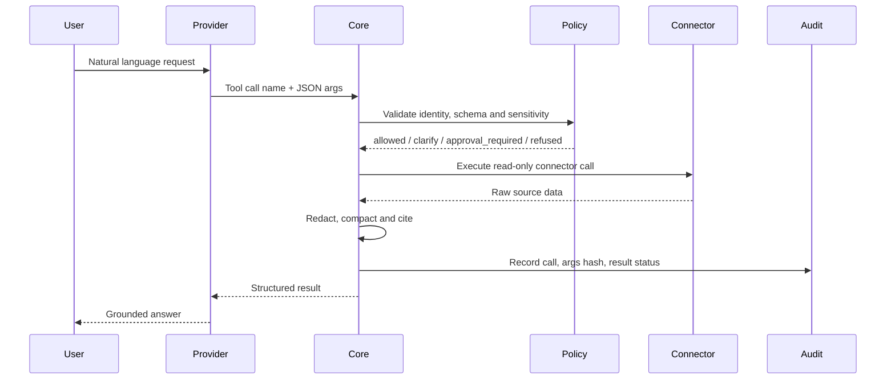

# Provider Compatibility for Tomcat Tools

Tomcat tools should be defined once in an internal catalog and adapted to each provider envelope. The execution authority stays inside Tomcat Core: models request tool calls, Core validates policy and arguments, executes connectors, redacts output, logs audit events and returns structured results.

References:

- [MCP Tools specification](https://modelcontextprotocol.io/specification/2025-11-25/server/tools)
- [OpenAI tools guide](https://developers.openai.com/api/docs/guides/tools)
- [Claude tool use overview](https://platform.claude.com/docs/en/agents-and-tools/tool-use/overview)
- [Anthropic advanced tool use](https://www.anthropic.com/engineering/advanced-tool-use)
- [Gemini tools guide](https://ai.google.dev/gemini-api/docs/tools)

## Canonical Tool Record

```ts
type TomcatToolDefinition = {
  name: string;
  title: string;
  description: string;
  inputSchema: JsonSchemaObject;
  outputSchema?: JsonSchemaObject;
  sensitivity: "public" | "internal" | "confidential" | "restricted";
  requiredPermission: string;
  sideEffect: "none" | "draft" | "write" | "send" | "export";
  approval: "never" | "restricted_data" | "external_action" | "always";
  sources: Array<"hubspot" | "monday" | "drive" | "linkedin" | "internal_db" | "transcripts">;
};
```

Keep `name`, `description` and `inputSchema` as the portable core. Provider adapters should be thin and deterministic.

## MCP Mapping

MCP is the cleanest target for Tomcat because it separates discovery (`tools/list`) from execution (`tools/call`).

```json
{
  "name": "crm.search_deals",
  "title": "Search HubSpot Deals",
  "description": "Search accessible HubSpot deals by stage, sector, owner, pipeline and recency.",
  "inputSchema": {
    "type": "object",
    "additionalProperties": false,
    "properties": {
      "query": { "type": ["string", "null"] },
      "sector": { "type": ["string", "null"] },
      "limit": { "type": "integer", "minimum": 1, "maximum": 50 }
    },
    "required": ["query", "sector", "limit"]
  },
  "outputSchema": {
    "type": "object",
    "properties": {
      "deals": { "type": "array" },
      "citations": { "type": "array" }
    },
    "required": ["deals", "citations"]
  }
}
```

Execution:

```json
{
  "jsonrpc": "2.0",
  "id": 42,
  "method": "tools/call",
  "params": {
    "name": "crm.search_deals",
    "arguments": {
      "query": null,
      "sector": "fintech",
      "limit": 20
    }
  }
}
```

Return `structuredContent` whenever possible. Also include serialized JSON in `content[0].text` for compatibility.

## OpenAI Mapping

Use Responses API tools. For Tomcat-managed functions, expose each tool as a function. For Tomcat MCP, OpenAI can also call a remote MCP server directly when appropriate.

```json
{
  "type": "function",
  "name": "crm.search_deals",
  "description": "Search accessible HubSpot deals by stage, sector, owner, pipeline and recency.",
  "parameters": {
    "type": "object",
    "additionalProperties": false,
    "properties": {
      "query": { "type": ["string", "null"] },
      "sector": { "type": ["string", "null"] },
      "limit": { "type": "integer" }
    },
    "required": ["query", "sector", "limit"]
  },
  "strict": true
}
```

OpenAI strict mode works best when fields are required and nullable instead of optional. Return tool outputs as compact JSON strings or provider-native function output objects, depending on the SDK surface. Preserve reasoning item IDs when using reasoning models.

Remote MCP shape:

```json
{
  "type": "mcp",
  "server_label": "tomcat_core",
  "server_description": "Tomcat Core read-only CRM, Monday and Drive tools.",
  "server_url": "https://core.tomcat.eu/mcp",
  "require_approval": "always"
}
```

## Claude Mapping

Use Claude client tools for Tomcat-executed functions. Add `strict: true` for stable schema conformance.

```json
{
  "name": "crm.search_deals",
  "description": "Search accessible HubSpot deals. Use this for dealflow questions that mention stage, sector, owner, pipeline, recency, or company name.",
  "input_schema": {
    "type": "object",
    "additionalProperties": false,
    "properties": {
      "query": { "type": ["string", "null"] },
      "sector": { "type": ["string", "null"] },
      "limit": { "type": "integer", "minimum": 1, "maximum": 50 }
    },
    "required": ["query", "sector", "limit"]
  },
  "strict": true
}
```

Claude-specific recommendations:

- Use a small always-loaded set: `tools.search_catalog`, `entity.resolve_company`, `policy.evaluate_request`.
- Defer most tools and rely on tool search when the catalog exceeds roughly 10-15 tools.
- For broad multi-step analysis, prefer programmatic orchestration where intermediate rows are processed outside model context.
- Provide tool use examples for confusing pairs like `crm.search_deals` vs `crm.summarize_notes`.

## Gemini Mapping

Gemini tools use function declarations. Keep schemas within the OpenAPI-like subset and avoid advanced JSON Schema constructs when possible.

```json
{
  "functionDeclarations": [
    {
      "name": "crm.search_deals",
      "description": "Search accessible HubSpot deals by stage, sector, owner, pipeline and recency.",
      "parameters": {
        "type": "object",
        "properties": {
          "query": { "type": "string", "nullable": true },
          "sector": { "type": "string", "nullable": true },
          "limit": { "type": "integer" }
        },
        "required": ["query", "sector", "limit"]
      }
    }
  ]
}
```

Gemini 3.1 Pro Preview has a dedicated custom tools model (`gemini-3.1-pro-preview-customtools`) for mixed bash/custom tooling. For Tomcat’s normal API path, `gemini-3.1-pro-preview` should be enough for function calls unless the workflow requires the custom tools endpoint.

## Differences to Normalize

| Concern | Canonical Tomcat Choice |
| --- | --- |
| Tool name | `domain.verb_object`, max 64 chars, MCP-safe charset |
| Optional args | Prefer required nullable fields for OpenAI strict compatibility |
| Output | Structured JSON object with citations and redactions |
| Errors | Separate validation, policy, connector and execution errors |
| Discovery | Internal catalog + `tools.search_catalog`; expose `tools/list` for MCP |
| Approval | Core-owned policy before execution, not model-owned |
| Audit | Log every tool call and policy decision |

## Execution Loop



## Benchmark Runner Shape

Each benchmark item should assert:

- Which tool or clarification should be selected.
- Whether the selected data source is allowed for the persona.
- Whether the output needs citations.
- Whether the request must stop for approval.
- Whether a provider-specific schema transform remains valid.

This makes the benchmark useful before connectors are complete: it tests routing, tool choice, policy boundaries and schema portability independently from live API data.
